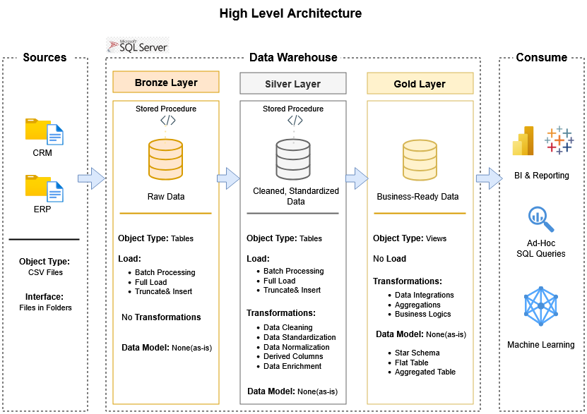

# Data Warehouse and Analytics Project

This project is based on the **Data Warehouse and Analytics Project by Data With Baraa**. I followed the tutorial and built the project as a hands-on learning project to improve my skills in SQL Server, ETL, data modeling, and data analytics.

---

## 🏗️ Data Architecture

The project follows the **Medallion Architecture**, which consists of three layers: **Bronze, Silver, and Gold**.



1. **Bronze Layer:** Stores the raw data from the source systems. The data is loaded from CSV files into SQL Server without major transformations.
2. **Silver Layer:** The data is cleaned, standardized, and transformed to make it ready for further analysis.
3. **Gold Layer:** Contains the final business-ready data, organized using a star schema for reporting and analytics.

---

## 📖 Project Overview

The main goal of this project is to build a data warehouse using SQL Server and prepare the data for analysis.

The project covers:
1. **Data Architecture**: Designing a Modern Data Warehouse Using Medallion Architecture **Bronze**, **Silver**, and **Gold** layers.
2. **ETL Pipelines**: Extracting, transforming, and loading data from source systems into the warehouse.
3. **Data Modeling**: Developing fact and dimension tables optimized for analytical queries.
4. **Analytics & Reporting**: Creating SQL-based reports and dashboards for actionable insights.
---

## 🚀 Project Requirements

### Building the Data Warehouse

The main objective is to build a modern data warehouse using SQL Server and combine data from different source systems into one model that can be used for analysis.

- **Data Sources**: Import data from two source systems (ERP and CRM) provided as CSV files.
- **Data Quality**: Cleanse and resolve data quality issues such as inconsistent values, missing data, and incorrect formats before analysis.
- **Integration**: Combine both sources into a single, user-friendly data model designed for analytical queries.
- **Scope**: Focus on the latest dataset only; historization of data is not required.
- **Documentation**: Provide clear documentation of the data model to support both business stakeholders and analytics teams.
---

## 📊 Analytics & Reporting

The project also includes SQL-based analysis around:

* Customer behavior
* Product performance
* Sales trends 

The goal is to use the data warehouse to generate useful business insights and answer common business questions.

---

## 📂 Repository Structure
```
data-warehouse-project/
│
├── datasets/                           # Raw ERP and CRM datasets
│
├── docs/                               # Project documentation and architecture details
│   ├── 1. data_architecture.png       # High-level overview of the project's data architecture, showing the main                                                    components and how they are connected.
│   ├── 2. naming-conventions.md       # Guidelines defining how tables, columns, files, and other data-related objects                                              should be named consistently.
│   ├── 3. data_flow.png               # Diagram illustrating how data moves between different sources, processing stages,                                           and destinations.
│   ├── 4. data_integration.png        # Diagram showing how data from different sources is collected, transformed,                                                 integrated, and made available for use.
│   ├── 5. data_models.png             # Diagram showing the project's data models and relationships, including the star                                             schema used for analytics.
│   └── 6. data_catalog.md             # Reference guide describing available datasets, their fields, definitions,                                                   metadata, and other important information.
│   
│
├── scripts/                            # SQL scripts
│   ├── bronze/                         # Loading raw data
│   ├── silver/                         # Cleaning and transforming data
│   └── gold/                           # Creating analytical models
│
├── tests/                              # Data quality and validation checks
│
├── README.md                          # Project overview and instructions
├── LICENSE                            # License information for the repository
└── .gitignore                         # Files and directories to be ignored by Git
```
---


## 🛠️ Tools & Technologies

* SQL Server
* SQL Server Management Studio (SSMS)
* SQL
* Git & GitHub
* Draw.io
* CSV
* Medallion Architecture
* Star Schema

---

## 🧩 What I'm Learning From This Project

I'm using this project to get more hands-on experience with:

* SQL and SQL Server
* Data Warehousing
* ETL
* Data Cleaning and Transformation
* Data Modeling
* Star Schema
* Data Quality
* Business Data Analysis

I'm also using the project to better understand how data moves from raw source files to a final model that can actually be used for analysis.

---

## 🛡️ License

This project is based on the **Data Warehouse and Analytics Project by Data With Baraa**.

The original project is licensed under the **MIT License**.

The original license and copyright information are kept in the `LICENSE` file.

---

## 🌟 About Me

Hi, I'm **Dina**.

I'm a Software Engineering graduate with over 2.5 years of professional experience working with Python, SQL, ERP systems, and business data.

Throughout my career, I've worked with Odoo ERP solutions and business teams, mainly dealing with CRM, purchases, sales, inventory, manufacturing, and operational data. This gave me a good understanding of how business processes and data are connected.

My experience also helped me build a strong foundation in data validation, database management, business analysis, and problem-solving.

I'm currently focusing more on **Data Engineering** and learning about ETL pipelines, PySpark, and modern data processing workflows through hands-on projects.

I'm interested in building reliable data solutions and improving my skills by working on real-world projects.
